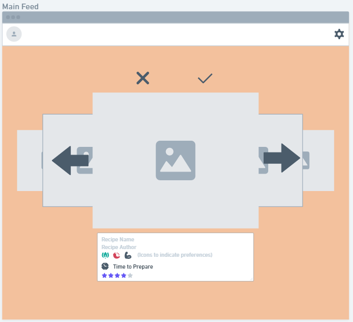

# Data Interactions
* User Data: Users can update their own personal information that can be displayed on their profile.
* User Recipes: Users can create their own recipes and save recipes made by other people.
* Recipe Data: Comments, likes, ratings, reactions, and a set of preferences matched to each recipe.
* Chatlogs: Messages exchanged between users are saved.

# Division of Labor
* Wireframe Design: Everyone
* Profile Account Pages: Jiaqi Ye
* Main Feed Page: Jiaqi Ye
* Profile Home Page: Isabella Chilton
* Recipe Creation Popup: Isabella Chilton
* Recipe Page: Daksh Dangi
* Chat Page: Daksh Dangi

# Wireframes Screenshots
Main Feed Page

This is the main page where users can discover new recipes made by other users. Users can cycle through recipes and select ones that they wanna match with. Users can see recipe info underneath the photo of the food.

Account and Profile Settings Pages

# HTML & CSS Screenshots