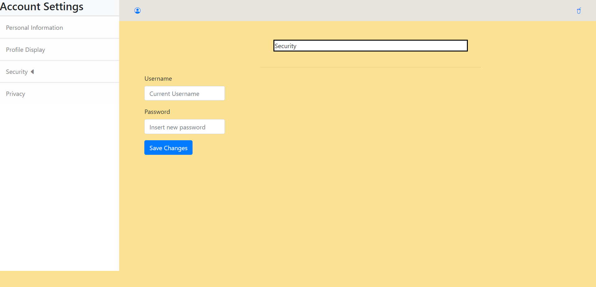

# Data Interactions
* User Data: Users can update their own personal information that can be displayed on their profile.
* User Recipes: Users can create their own recipes and save recipes made by other people.
* Recipe Data: Comments, likes, ratings, reactions, and a set of preferences matched to each recipe.
* Chatlogs: Messages exchanged between users are saved.

# Division of Labor
* Wireframe Design: Everyone
* Profile Account Settings Pages: Jiaqi Ye
* Main Feed Page: Jiaqi Ye
* Profile Home Page: Isabella Chilton
* Recipe Creation Popup: Isabella Chilton
* Recipe Page: Daksh Dangi
* Chat Page: Daksh Dangi

# Wireframes Screenshots
Main Feed Page\
\
This is the main page where users can discover new recipes made by other users. Users can cycle through recipes and select ones that they wanna match with. Users can see recipe info underneath the photo of the food.

Profile Page\
\
\
This is the main profile page. Here, users can view recipes that they have written or recipes that they have matches with. They can also view their profile information such as profile picture, username, preferences, and bio.

Recipe Creation Pop-up\
\
When users clicks the "Create Recipe" button on the profile page, this window will pop up, allowing users to create a new recipe.

Profile Account Settings Pages

Personal Information Page\
\
This is the page in the account settings where users can edit their personal information: name, location, and preferences.

Profile Display Page\
\
This is the page in the account settings where users can edit their profile display settings: display name, profile picture, and description for their profile.

Security Page\
\
This is the page in the account settings where users can edit their security preferences and security-related data: username and password.

Privacy Page\
\
This is the page in the account settings where users can edit their privacy preferences, choosing which information to show to the public: username, description, preferences, recipes, etc.

Recipe Page\
\
This is the page displayed to users when they are considering if they like a given dish or not. Along with an image of the actual dish, users are provided with a comment section and icons indicating various attributes for the dish.

Chat Page\
\
This is the page on which users interact with other users with regards to questions about preparation, recipes, etc.

# HTML & CSS Screenshots
Main Feed Page\
\
\
\

Profile Page\
\
\

Recipe Creation Pop-up\
\

Personal Information Page\
\

Profile Display Page\
\

Security Page\
\

Privacy Page\
\

Recipe Page\
\

Chat Page\
\
