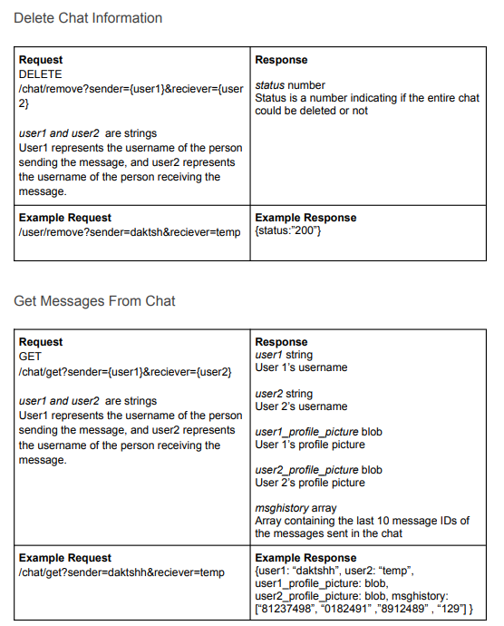

# Come Look at My Food API

Note: Final source files for milestone2 are in branch milestone2, not main.

## Link

Link to the website on Heroku: https://test-326.herokuapp.com

The login username is test, the password is test.

Note: When you click the green button, it takes you to the recipe page.

## Breakdown of Labor

API Documentation: Everyone

Backend Skeleton Code (server.js, database.js):

* Recipe Objects, Like Objects: Isabella
* User Objects, Comment Objects: Jiaqi
* Message Objects, Chat Object: Daksh

Front-End Implementation:
* Profile Page, Recipe Creation Popup: Isabella
* Main Feed, Account Settings: Jiaqi
* Recipe Page, Chat Page: Daksh

Server Implementation/Deployment: Daksh

# Examples of CRUD Functionality
Here are screenshots for examples of CRUD functionality:
Create (a recipe)\
This is a recipe popup for recipe creation. When the user presses the creation button, they are prompted to enter information for a new recipe, and then they can post it or delete it.\
\
Read (recipe info on load, and render on the page)\
This is the main feed page, where the user can explore recipes that the site shows to them. On load, recipe data is fetched and displayed for the user to view. Here, the user can choose to save recipes (or not) and read about the recipe.\
\
Update (press green button to add to user's saved recipes, updating user info)\
This is the main feed page. When the user presses the green button, the recipe is saved to the user's saved recipes because the user decided that they like this particular recipe. This updates the user's information (specially, the saved recipes). Then, the user can go to their own profile page to view their saved recipes.\
\
Delete (press the heart to delete a recipe from the user's saved recipes)\
This is the saved recipes section of a user's profile page. Here, the user can view all the recipes they saved, and little previews of the recipes. The user can choose to unlike the recipe to delete it from their saved recipes.\
\

# API

Here is a brief and precise representation of APIs for the application:
\
\
\
\
\
\
\
\
\
\
\
\
\
\
